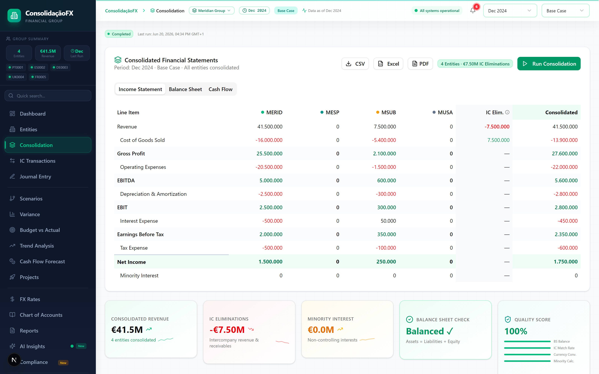
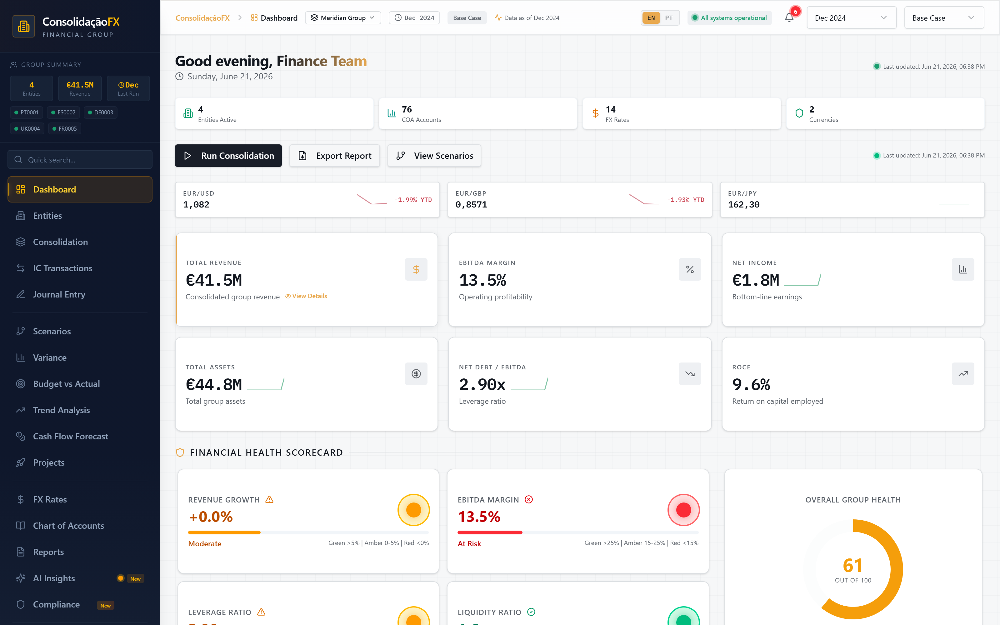
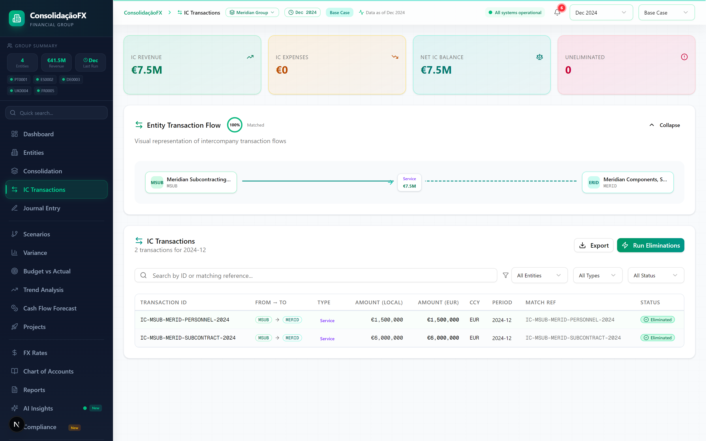
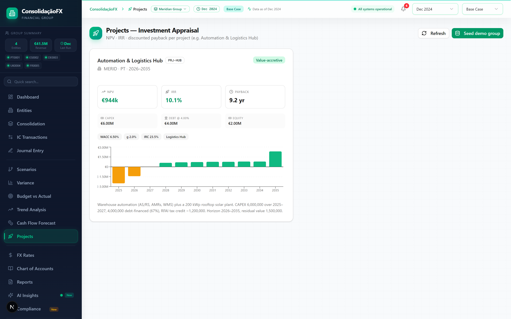

# finance-global-model

Multi-entity financial consolidation model — Next.js 16, Prisma/SQLite, shadcn/ui.

Designed as a **template for any company group**: the core (consolidation engine, finance domain math, API, UI) is company-agnostic; company data and country tax rules plug in as modules.

The interface is **bilingual (English / Português)** — a toggle in the header switches the whole UI instantly (powered by `next-intl`, persisted per browser). Numbers and currency stay in the EUR/`de-DE` grouping convention regardless of language.

## Screenshots

All figures below are the fictional **Meridian Group** demo, computed live by the consolidation engine (the UI reads the engine output, not static mock data) and reconciling to the cent.

**Consolidated statements.** Per-entity columns, the intercompany elimination column and the consolidated result, side by side. Internal sales from Meridian Subcontracting to Meridian Components are netted out, so group revenue falls from the €49.0M entity sum to €41.5M consolidated, and the balance sheet ties to zero.



**Group dashboard.** Consolidated KPIs, an FX snapshot and a financial-health scorecard derived from the live numbers.



**Intercompany transactions.** Matched IC flows between entities and the eliminations that remove them on consolidation.



**Investment appraisal.** NPV, IRR and discounted payback for a capital project, including the Portuguese RFAI tax credit.



## Quick start

```bash
npm install
npm run db:deploy        # apply migrations → SQLite schema (db/custom.db)
npm run dev              # http://localhost:3000
```

The schema is migration-managed (`prisma/migrations/`, baselined as `0_init`).
Use `npm run db:deploy` on a fresh clone; `npm run db:migrate` when you change
`schema.prisma`. `npm run db:push` still works for a throwaway local DB but does
not record a migration.

Load the demo company (Meridian Group, a small fictional multinational):

```bash
curl -X POST "http://localhost:3000/api/packs" \
  -H "Content-Type: application/json" \
  -d '{"packId": "template", "reset": true}'
```

Run the test suite (golden-value reconciliation of the demo pack):

```bash
npm test
```

All demo numbers are invented. Each entity's balance sheet reconciles to the
cent and the group totals tie to the standalone entities after intercompany
elimination, so every figure is reproducible from `src/lib/company-packs/template.ts`.

## Architecture

| Layer                | Where                             | Role                                                                                                                                                                                                     |
| -------------------- | --------------------------------- | -------------------------------------------------------------------------------------------------------------------------------------------------------------------------------------------------------- |
| Finance domain       | `src/lib/finance`                 | Single source of truth: COA→statement mapping, FX, statement derivation, KPIs, and cent-level rounding (`money.ts`). Pure functions, unit-tested.                                                        |
| Consolidation engine | `src/lib/consolidation-engine.ts` | Orchestrates: trial balances → entity statements → IC eliminations → group statements. Idempotent per period.                                                                                            |
| Company packs        | `src/lib/company-packs`           | Pluggable company data sets (entities, trial balance, IC transactions, FX, projects). `template` (Meridian Group) is the reference pack.                                                                 |
| Tax jurisdictions    | `src/lib/tax`                     | Pluggable per-country tax providers keyed by entity `countryCode`. `PT` implements the full IRC chain (derrama municipal/estadual, tributação autónoma, SIFIDE/RFAI/ICE); `ES`/`US` are flat-rate stubs. |
| Projects             | `src/lib/projects`                | Investment appraisal: NPV / IRR / discounted payback, finite horizon + residual value.                                                                                                                   |
| Group COA            | `src/lib/coa-data.ts`             | Shared group chart of accounts all packs map onto.                                                                                                                                                       |
| Operations           | `src/lib/operations`              | Bottom-up operational catalog: `Product`, `RawMaterial`, `BillOfMaterial`, and `SalesMix`. Reconstructs gross margin and generates trial-balance revenue/COGS lines.                                     |

## Currency translation (IAS 21)

Foreign subsidiaries are consolidated using the **current-rate method**. A EUR
entity (functional currency = the group's presentation currency) needs no
translation, so the engine keeps its original per-line EUR path untouched. A
non-EUR entity is assembled in its **functional currency** and then the whole
sheet is translated into EUR at three different rates:

| Statement area                 | Rate applied         | Why                                              |
| ------------------------------ | -------------------- | ------------------------------------------------ |
| Income & expenses              | **Average** rate     | Proxy for the spot rate at each transaction date |
| Assets & liabilities           | **Closing** rate     | Carried at the period-end spot rate              |
| Contributed / pre-existing equity | **Historical** rate | Frozen at the rate when the equity arose         |

Because the three rates differ, translated assets no longer equal translated
liabilities + equity. IAS 21 does **not** force that gap into the P&L — the
residual is the **Cumulative Translation Adjustment (CTA)**, recognised in OCI
as a separate component of equity. The CTA is therefore exactly the plug that
makes the translated sheet balance; it is a *meaningful* number (the FX effect on
the parent's net investment), not an error. When all three rates are equal it
collapses to zero, which is why the all-EUR demo group and every golden test are
unaffected by this machinery.

### Worked example — Meridian USA (USD)

A small, locally-balanced USD subsidiary, translated at the demo's seeded ECB
rates (`1 EUR = X USD`): closing **1.082**, average **1.079**, historical
**1.104**.

| Line                         | Local (USD)  | Rate           | EUR            |
| ---------------------------- | ------------ | -------------- | -------------- |
| Revenue                      | 1,000,000    | 1.079 (avg)    | 926,784.06     |
| COGS                         | (600,000)    | 1.079 (avg)    | (556,070.44)   |
| **Net income**               | **400,000**  |                | **370,713.62** |
| Cash → **Total assets**      | 2,400,000    | 1.082 (close)  | 2,218,114.60   |
| Share capital                | 2,000,000    | 1.104 (hist)   | 1,811,594.20   |
| Retained earnings (= result) | 400,000      | 1.079 (avg)    | 370,713.62     |
| Equity before CTA            |              |                | 2,182,307.82   |
| **CTA** (plug)               |              |                | **35,806.78**  |
| **Total equity incl. CTA**   |              |                | **2,218,114.60** |

Total equity incl. CTA (2,218,114.60) = total assets (2,218,114.60) → the sheet
reconciles. Consolidated with the EUR parent, the group still balances and the
run is reported **completed**, with the CTA visible as its own equity line.

- Code: `src/lib/finance/translation.ts` (pure, `translateForeignEntity`) wired
  into `buildForeignEntityFinancials` in the engine.
- Tests: `src/lib/finance/translation.test.ts` (this worked example, plus the
  rates-equal and EUR-identity cases) and `src/lib/fx-translation.engine.test.ts`
  (a USD MUSA book consolidated end-to-end).

## Tax reconciliation

The consolidation engine treats income tax as a **stored** trial-balance line
(`TAX-001/2/3`), while `src/lib/tax` models IRC per jurisdiction from taxable
income. These can silently drift. The engine now reconciles the two on every run —
following one principle: **reconcile, don't replace.**

- **On actuals, reconciliation is informational.** Each run attaches a
  `taxReconciliation` block comparing stored IRC against the per-entity modelled
  tax (summed per entity — the correct basis for Portugal's progressive *derrama
  estadual*). Net income is **not** changed: real booked IRC reflects
  SIFIDE/RFAI/ICE credits and RAI→*lucro tributável* adjustments the EBT-based
  model can't reproduce, so it stays authoritative. For the Meridian demo (PT 2024)
  the group drift is **stored €600,000 vs modelled €543,750 = +€56,250**.
- **Unmodelled jurisdictions don't fabricate tax.** Countries without a provider
  (DE/FR/UK/IT) fall back to a 0% stub; if any in-scope entity uses it, the group
  is flagged **not comparable** rather than reported as a 100% over-book.
- **Persisted + surfaced.** The drift (when comparable) and a `taxComparable` flag
  are written to each `ConsolidationRun`, and a *Tax Reconciliation* check appears
  in the Compliance view — the only check that can see tax drift, since the
  balance-sheet integrity gate can't (booked tax and its offsetting payable net to
  zero).
- **Forecasts can opt in to modelled tax.** Passing `computeTaxForProjections: true`
  replaces booked tax with modelled IRC on forecast/budget periods, accruing the
  incremental tax as a payable so the sheet still balances. Off by default; actuals
  are never touched.

Code: `src/lib/tax/reconcile.ts` (pure), wired into `src/lib/consolidation-engine.ts`.
Tests: `src/lib/finance/tax-drift.test.ts` (module) and the tax-reconciliation
block in `src/lib/consolidation-engine.test.ts` (engine).

## Operational Catalog

The model supports a robust **bottom-up operational catalog** for manufacturing and trading entities (managed via Prisma SQL: `Product`, `RawMaterial`, `BillOfMaterial`, and `SalesMix`). 

This acts as the driver for the entity's actual financial performance:

- **Revenue** is computed dynamically per product (`annualVolume` × `salesPricePerUnit`) and distributed via the `SalesMix`.
- **Cost of Goods Sold (COGS)** is computed by mapping the product's `BillOfMaterial` to `RawMaterial` unit costs, plus direct labor and overhead.
- These calculations automatically generate the **REV** (Revenue) and **COGS** trial-balance lines for the entity, ensuring that the financial consolidation is perfectly tied to the physical operational realities of the factories and stores.

You can add or modify products and raw materials directly via your favorite SQL client or by running `npx prisma studio`. Any changes will instantly reflect in the dashboards and consolidation engine.

## Onboarding a new company

Two paths:

**1. Company pack (code, reproducible).** Create `src/lib/company-packs/<company>.ts` satisfying the `CompanyPack` interface (see `types.ts`), register it in `company-packs/index.ts`, then `POST /api/packs {"packId": "<company>", "reset": true}`. Best when you have a one-off historical dataset you want under version control. The `template` (Meridian Group) pack is the worked example to copy.

**2. API flow (runtime).**

1. `POST /api/entities` — create each legal entity (code, country, currency, ownership, consolidation method).
2. Map your local chart of accounts onto the group COA (`GET /api/coa` for codes; `POST /api/coa/mappings` to record the mapping).
3. `POST /api/import` — load trial balances per entity/period. Non-EUR amounts are converted with the stored closing rate (or an explicit `exchangeRateUsed`); manage rates via `/api/exchange-rates`.
4. Flag intercompany rows (`isIntercompany`, `icPartnerEntityId`) and/or record IC transactions via `/api/ic-transactions`.
5. `POST /api/consolidation` — run the period. Re-running is safe: elimination state is reset and recomputed each run.

## Conventions

- Amounts in **full currency units** (not thousands). Costs are stored **negative**.
- FX rates follow ECB convention: `1 EUR = X currency`; `amountEUR = amountLocal / rate`.
- Annual actuals are stored as a single `YYYY-12` snapshot with `periodType: 'actual'`.
- Only **detail** COA codes carry amounts; all subtotals (current assets, EBITDA, …) are recomputed, never trusted from storage.
- **Integer-cents quantization at projection seams.** `round2()` in `src/lib/finance/money.ts` (half-up, away from zero) is applied to each period's driver-computed lines (revenue, COGS, OPEX, depreciation, working-capital balances, PPE) so float errors cannot compound across a multi-year / Monte-Carlo run. The cash plug and income-statement finalisation chain are left unrounded to preserve the double-entry identity exactly.

## Security / auth posture

This is a **single-tenant** app: one shared dataset, with **real credential login
and role-based authorization** deciding who may change it (LOW.5). Reads stay open
so a recruiter or reviewer can explore every dashboard, run consolidations and play
with scenarios without signing in; mutations are gated by role.

**Authentication** (`src/lib/auth/*`) is built on the Web Crypto API — no external
dependency, no native bindings, and edge-compatible so the same code verifies
sessions in `src/middleware.ts`:

- Passwords are stored as **PBKDF2-SHA256** hashes (`pbkdf2$<iters>$<salt>$<hash>`).
- Sessions are **stateless, HMAC-signed cookies** (httpOnly, SameSite=Lax,
  Secure in production) — no server-side session store.
- `AUTH_SECRET` signs/verifies the session. In production it **must** be set;
  locally it falls back to a clearly-insecure constant so the demo works with
  zero config.

**Authorization** (`src/lib/auth/policy.ts`) maps three roles onto capabilities
(segregation of duties):

| Role | Can |
|------|-----|
| `viewer` | read-only |
| `preparer` | + run/import/edit the dataset |
| `approver` | + destructive/structural actions (any `DELETE`, re-seed/reset via `POST /api/packs`) |

The `src/middleware.ts` guard activates when **either** `AUTH_SECRET` **or**
`ADMIN_TOKEN` is set (pure local dev, with neither, stays fully open). When
active: reads pass; the auth-bootstrap (`/api/auth/login`,`/logout`) and
compute-only POSTs (`/api/consolidation`, `/api/scenarios/run`) stay open to keep
the demo explorable; every other mutation needs a session whose role permits it,
or — as a CI/script escape hatch — the legacy `ADMIN_TOKEN` (`x-admin-token`
header / `admin_token` cookie) for full access.

**Demo accounts** (seeded with the template pack, one per role; visible on the
login page): `approver@demo.local`, `preparer@demo.local`, `viewer@demo.local` —
each with the password equal to its role. Real deployments create their own users
and set `AUTH_SECRET`.

**Remaining gap — multi-tenancy:** the model is still single-tenant. Isolating
multiple groups would add a `tenantId` to `Entity`/`TrialBalance`/`ConsolidationRun`
and scope every query by it; the auth layer and middleware matcher already
centralise where identity is established.

## Known limitations & follow-ups

The full backlog (quick wins, deferred polish) lives in [`PLAN.md`](PLAN.md).
Completed work is in [`CHANGELOG.md`](CHANGELOG.md). The two remaining items:

- **FX deferred polish.** Per-tranche historical equity rates (v1 uses
  acquisition-date or closing); CTA recycling to P&L on disposal (IAS 21 §48, out
  of scope until disposals are modelled); period-weighted average rates when monthly
  FX data is available.
- **Multi-tenancy.** A `tenantId` on every table + query scoping. Out of scope for
  the single-tenant model but the natural next step if the app serves multiple groups.

The codebase typechecks cleanly under `strict` and `next build` enforces TypeScript.
ESLint runs at **0 errors**; 24 React-Compiler-readiness `set-state-in-effect`
warnings in view components are runtime-safe and tracked for a follow-up sweep.
